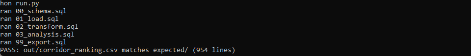
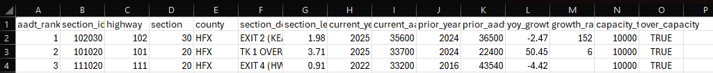

# 05 — Busiest-corridor AADT ranking

Ranks Nova Scotia's provincial highway segments by annual average daily traffic (AADT), measures how fast each one is growing, and flags the segments at or above a two-lane capacity threshold. The busiest segment is Highway 102 between Exit 2 (Kearney Lake Road) and Exit 2B (Larry Uteck Boulevard) in Halifax County, at 35,600 vehicles per day.

## The data

Nova Scotia Open Data: **Traffic Volumes Provincial Highway** (`8524-ec3n`). Source, licence, and pull date in SOURCE.md. (Catalog idea #17.)

## What it computes

Every step is deterministic and rule based, and all of the logic lives in `sql/`, named by step. `run.py` holds none of it. The pipeline reduces the raw counts to one peak AADT per segment per year, ranks the segments by their most recent AADT, and computes each segment's annualized growth since its previous count with a `LAG` window function. It then flags any segment whose latest AADT is at or above 10,000 vehicles per day, the planning threshold this project uses for a two-lane highway (spec.md explains the choice). A second ranking picks out the fastest-growing established corridors: Highway 111 from Exit 7 (Portland Street) to Exit 8 (Mount Hope Avenue) leads, up 70 percent year over year.

## Testing

DuckDB is the only dependency:

    pip install duckdb

From this folder:

    python run.py            # runs the SQL end to end, then verifies
    python run.py verify     # re-runs the golden diff only

`python run.py` writes out/corridor_ranking.csv, checks it against expected/corridor_ranking.csv, and prints PASS when they match row for row.

## License

MIT. Copyright (c) 2026 Kevin Yu (https://github.com/exekyute).
