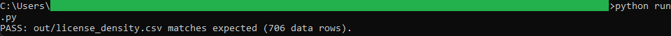
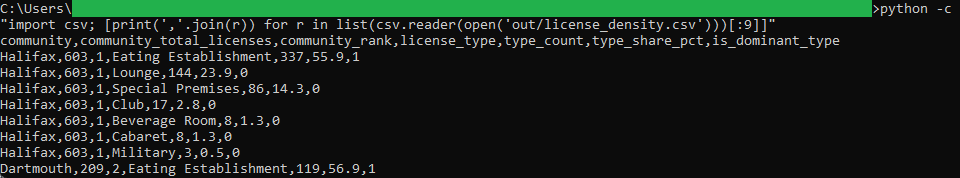

# 06: Liquor-license density by community

Which Nova Scotia communities hold the most permanent liquor licenses, and what the license mix looks like inside each one. Halifax leads with 603 licenses, and more than half of them (55.9%) are Eating Establishments.

## The data

Nova Scotia Open Data: **Permanent Liquor Licenses** (`en23-iwca`). Source, licence, and pull date in SOURCE.md. (Catalog idea #29.)

## What it computes

Every count, share, rank, and sort order is defined in the `sql/` files, named by step; `run.py` holds no logic. The pipeline cleans the community name and license type (`02_transform.sql`), counts licenses per community and per license type within each community (`03_analysis.sql`), ranks communities by total, and marks each community's most common type. The result is one row per community and license type, carrying the community total, its rank, the type's share, and a dominant-type flag.

## Testing

DuckDB is the only dependency:

    pip install duckdb

From this folder:

    python run.py            # runs the SQL end to end, then verifies
    python run.py verify     # re-runs the golden diff only

`python run.py` writes out/license_density.csv, checks it against expected/license_density.csv, and prints PASS when they match row for row.

## License

MIT. Copyright (c) 2026 Kevin Yu (https://github.com/exekyute).
