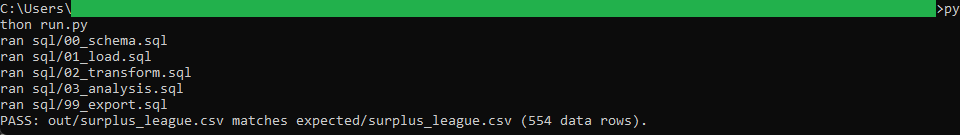
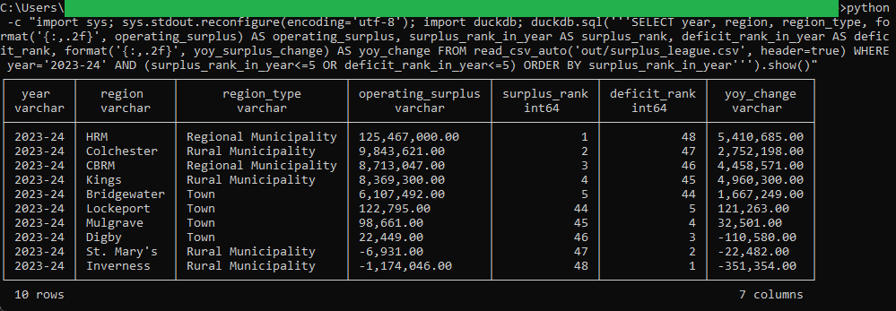

# 07: Municipal surplus/deficit league table

Which Nova Scotia municipalities run the largest operating surpluses and deficits, ranked by year. In the latest year on file (2023-24), Halifax Regional Municipality posts the largest operating surplus at $125,467,000.00 and the Municipality of the County of Inverness the largest deficit at -$1,174,046.00.

## The data

Nova Scotia Open Data: **Municipal Fiscal Statistics Operating Fund** (`sbzw-ajrm`). Source, licence, and pull date are in SOURCE.md. (Catalog idea #1.)

## What it computes

Operating surplus is total operating revenue minus total operating expenditure, computed for every municipality in every fiscal year. Each year the municipalities are ranked from largest surplus to largest deficit, year-over-year change is measured with a LAG window, and each municipality carries its multi-year average as a trend baseline. A municipality is identified by the pair (region, region type), because a few names belong to both a Town and a separate Rural Municipality. All of this lives in `sql/`, one step per file; `run.py` holds no analytical logic. The money is kept to the cent and every surplus ties to its revenue and expenditure exactly.

## Testing

DuckDB is the only dependency:

    pip install duckdb

From this folder:

    python run.py            # runs the SQL end to end, then verifies
    python run.py verify     # re-runs the golden diff only

`python run.py` writes out/surplus_league.csv, checks it against expected/surplus_league.csv, and prints PASS when they match row for row.

## License

MIT. Copyright (c) 2026 Kevin Yu (https://github.com/exekyute).
