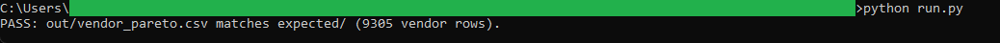
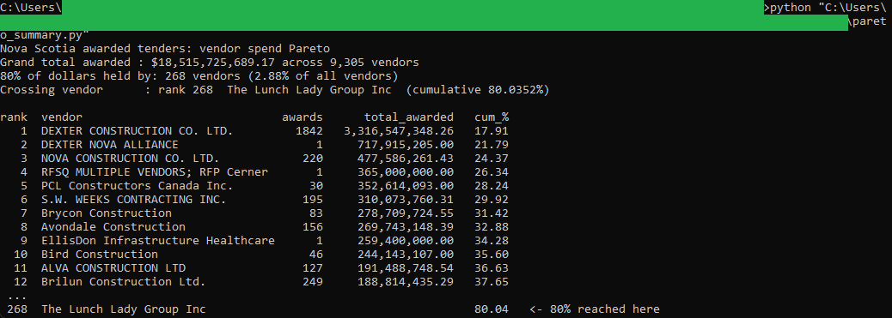

# 08: Procurement spend Pareto

Awarded tender spending in Nova Scotia is heavily concentrated: about 268 vendors, roughly 3 percent of the 9,305 named vendors in the data, take 80 percent of the award dollars.

## The data

Nova Scotia Open Data: **Awarded Public Tenders** (`m6ps-8j6u`). Source, licence, and pull date in SOURCE.md. (Catalog idea #4.)

## What it computes

Everything is deterministic and rule-based, and all of the logic lives in `sql/`, one file per step, each commented with the question it answers. `run.py` holds no logic. The build sums award dollars by vendor after normalizing vendor names so that spelling and legal-suffix variants land on one entity, then walks the vendors from largest to smallest with window functions to build a running total and a cumulative share of all award dollars. It flags the smallest set of top vendors whose share reaches 80 percent, records each vendor's award count next to its dollars, and marks repeat vendors (more than one award). Money ties to the cent.

## Testing

DuckDB is the only dependency:

    pip install duckdb

From this folder:

    python run.py            # runs the SQL end to end, then verifies
    python run.py verify     # re-runs the golden diff only

`python run.py` writes out/vendor_pareto.csv, checks it against expected/vendor_pareto.csv, and prints PASS when they match row for row.

## License

MIT. Copyright (c) 2026 Kevin Yu (https://github.com/exekyute).
