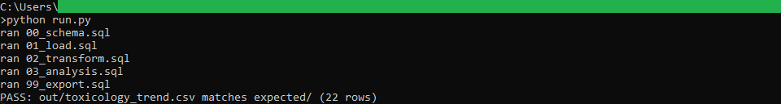
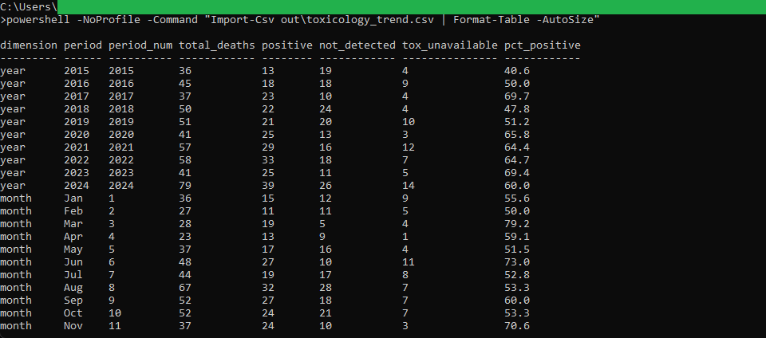

# 09: Impaired-driving toxicology trend

Nova Scotia driver deaths grouped by toxicology outcome across 2015 to 2024, with the share that tested positive each year and the count of deaths by month. Among drivers who had a toxicology result, the positive share rose from 40.6 percent in 2015 to 60.0 percent in 2024. August has the most driver deaths of any month over the ten years, with 67.

## The data

Nova Scotia Open Data: **Motor Vehicle Driver Deaths** (`huvt-4vtx`). Source, licence, and pull date in SOURCE.md. (Catalog idea #20.)

## What it computes

For every year, the deaths that tested positive ("One or more specified drug(s) detected"), the deaths with nothing detected, and the deaths with no toxicology result available. Percent positive is the positive count divided by the deaths that had a result, so pending or unavailable cases do not distort it. The same three outcomes are also totalled by calendar month, pooled across all years, to show seasonality. All of this is rule based: the logic lives in `sql/`, named by step, and `run.py` holds none of it.

## Testing

DuckDB is the only dependency:

    pip install duckdb

From this folder:

    python run.py            # runs the SQL end to end, then verifies
    python run.py verify     # re-runs the golden diff only

`python run.py` writes out/toxicology_trend.csv, checks it against expected/toxicology_trend.csv, and prints PASS when they match row for row.

## License

MIT. Copyright (c) 2026 Kevin Yu (https://github.com/exekyute).
