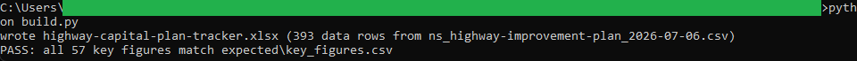
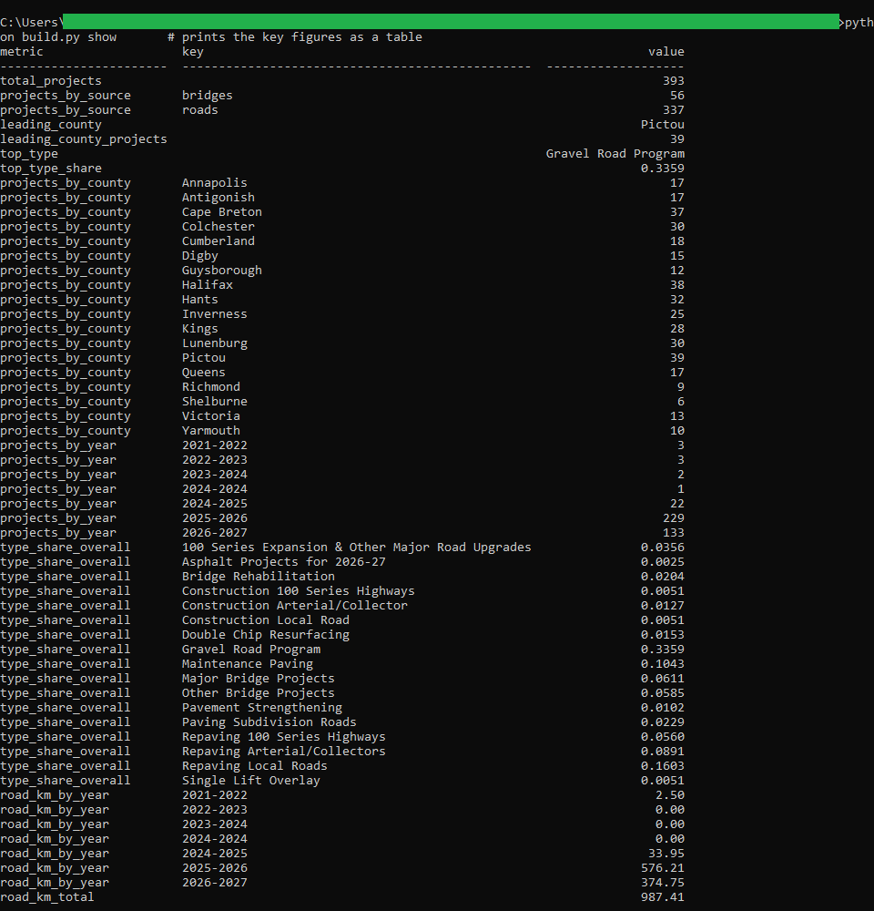

# 10: Highway capital-plan tracker

Pivots Nova Scotia's published Highway Improvement Plan (393 road and bridge projects) by county, fiscal year, and project type in a formula-driven Excel workbook. The headline: Pictou County leads the plan with 39 projects, the Gravel Road Program is the largest project type at 33.59 percent, and 987.41 km of road work is on the books.

## The data

Nova Scotia Open Data: **Highway Improvement Plan** (`ax9v-hhtx`). Source, licence, and pull date in SOURCE.md. (Catalog idea #22.)

## What it computes

Every figure is deterministic and rule-based, and the workbook holds no VBA and no macros. The Model sheet computes county-by-fiscal-year project pivots, the project-type mix with each type's share of the plan, and planned road kilometres per fiscal year, all as live SUMIFS/COUNTIFS and INDEX/MATCH formulas over the Data sheet. The plan publishes no dollar figures, so the cadence measures are project counts and kilometres rather than spend. build.py regenerates the workbook from the pinned snapshot and verifies every key figure against a plain-Python recomputation of the same numbers.

## Testing

openpyxl is the only dependency:

    pip install openpyxl

From this folder:

    python build.py            # rebuilds the workbook, then verifies
    python build.py verify     # re-runs the key-figure check only
    python build.py show       # prints the key figures as a table

`python build.py` regenerates highway-capital-plan-tracker.xlsx and checks every key figure against expected/key_figures.csv, printing PASS when they match. Open the workbook afterward; the Model sheet's headline cells (mapped in spec.md) show the same figures.

## License

MIT. Copyright (c) 2026 Kevin Yu (https://github.com/exekyute).
