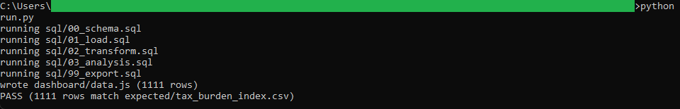
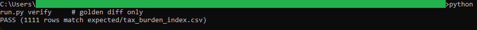
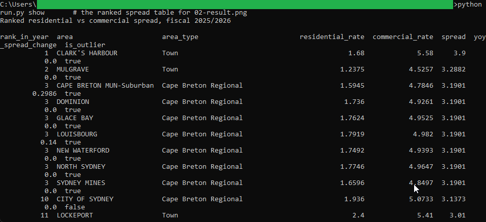
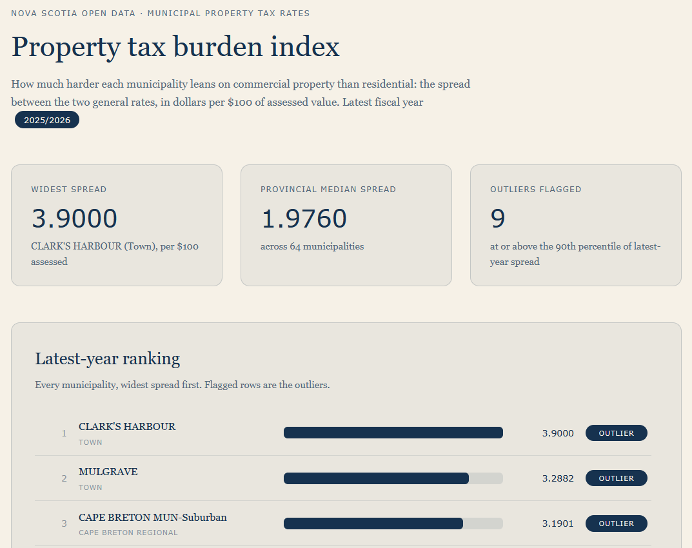

# 11: Property tax burden index

Ranks all 64 Nova Scotia municipalities by how much heavier their commercial tax rate is than their residential rate. In fiscal 2025/2026 the Town of Clark's Harbour has the widest spread in the province: 3.9000 dollars per $100 of assessed value (5.58 commercial against 1.68 residential), roughly double the provincial median spread of 1.9760.

## The data

Nova Scotia Open Data: **Municipal Property Tax Rates** (`ure8-3w7m`). Source, licence, and pull date in SOURCE.md. (Catalog idea #2.)

## What it computes

The spread between each municipality's commercial and residential general tax rates, per $100 of assessed value, for every fiscal year in the data. The pipeline ranks municipalities by spread within each year and flags the widest latest-year spreads as outliers (at or above the 90th percentile; the exact rule is in spec.md). Year-over-year spread movement comes from LAG over each municipality's own year sequence. All of the logic lives in `sql/`, named by step; `run.py` holds none of it. The browser dashboard re-derives the same figures in JavaScript from the exported data and must match the golden output exactly.

## Testing

DuckDB is the only dependency:

    pip install duckdb

From this folder:

    python run.py            # runs the SQL end to end, then verifies
    python run.py verify     # re-runs the golden diff only
    python run.py show       # prints the ranked spread table

`python run.py` writes out/tax_burden_index.csv, checks it against expected/tax_burden_index.csv, and prints PASS when they match row for row. Then double-click dashboard/dashboard.html; it reads the exported data and re-derives the same headline figures. The Power BI build guide is in bi/README.md.

## License

MIT. Copyright (c) 2026 Kevin Yu (https://github.com/exekyute).
