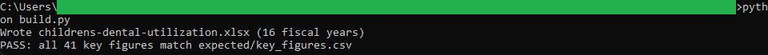
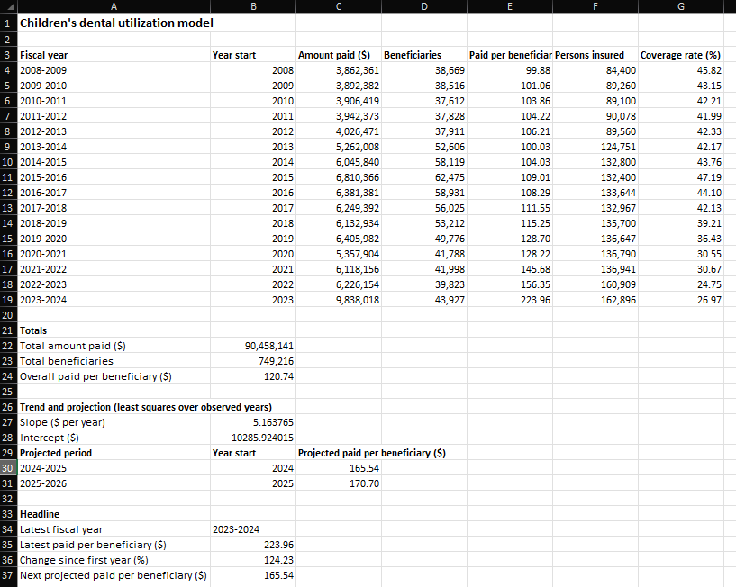

# 12: Children's dental utilization model

Models what Nova Scotia's children's oral health program pays per child who uses it. The headline: paid-per-beneficiary reached $223.96 in 2023-2024, up 124 percent from $99.88 in 2008-2009, while the least squares trend puts the next period at $165.54, well under the latest spike.

## The data

Nova Scotia Open Data: **Children's Oral Health Utilization** (`saqh-58pj`). Source, licence, and pull date in SOURCE.md. (Catalog idea #15.)

## What it computes

The Model sheet computes paid-per-beneficiary and coverage rate for each fiscal year as live divisions over the Data sheet, plus sums that tie exactly to the snapshot and a two-period projection written as `ROUND(INTERCEPT(...) + SLOPE(...) * year, 2)`, plain least squares over the observed years. Nothing is pasted and nothing is random. `build.py` regenerates the workbook, then verifies every key figure against a Python recomputation that uses the same closed-form slope and intercept, so the cells and the golden file agree by construction.

## Testing

openpyxl is the only dependency:

    pip install openpyxl

From this folder:

    python build.py            # rebuilds the workbook, then verifies
    python build.py verify     # re-runs the key-figure check only
    python build.py show       # prints the key figures as a table

`python build.py` regenerates childrens-dental-utilization.xlsx and checks every key figure against expected/key_figures.csv, printing PASS when they match. Open the workbook afterward; the Model sheet's headline cells (mapped in spec.md) show the same figures.

## License

MIT. Copyright (c) 2026 Kevin Yu (https://github.com/exekyute).
