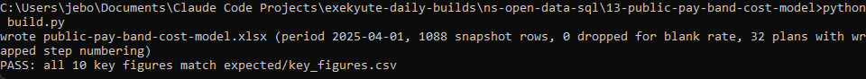
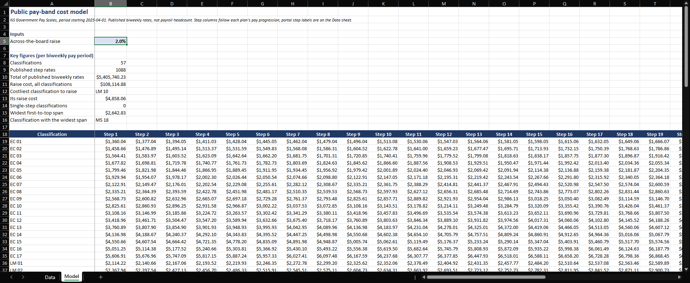

# 13: Public pay-band cost model

Prices an across-the-board raise on Nova Scotia's current published pay scale. At the default 2 percent, lifting all 1,088 published step rates across 57 non-union classifications costs $108,114.88 per biweekly pay period, with LM 10 the costliest single classification at $4,858.06.

## The data

Nova Scotia Open Data: **NS Government Pay Scales** (`hn6q-5dmm`). Source, licence, and pull date in SOURCE.md. (Catalog idea #6.)

## What it computes

The model runs entirely on live Excel formulas, with no VBA and no macros. The Model sheet pivots the current scale period (2025-04-01, the Excluded scale) into a pay-band grid, one row per classification and one column per progression step, then derives each classification's one-step cost and first-to-top span with live formulas. An Inputs cell holds the raise percentage, default 2 percent, and drives the raise cost by classification and in total. The dataset is the published scale, not payroll headcount, so a raise cost here is the cost of lifting each published rate once, not actual payroll cost; build.py regenerates the workbook and verifies every key figure in plain Python at the default 2 percent input.

## Testing

openpyxl is the only dependency:

    pip install openpyxl

From this folder:

    python build.py            # rebuilds the workbook, then verifies
    python build.py verify     # re-runs the key-figure check only
    python build.py show       # prints the key figures as a table

`python build.py` regenerates public-pay-band-cost-model.xlsx and checks every key figure against expected/key_figures.csv at the default 2 percent input, printing PASS when they match. Open the workbook afterward; change the Inputs raise cell and the model recomputes live. At the default 2 percent input, the Model sheet's headline cells (mapped in spec.md) show the same figures as expected/key_figures.csv.

## License

MIT. Copyright (c) 2026 Kevin Yu (https://github.com/exekyute).
