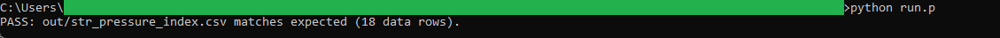
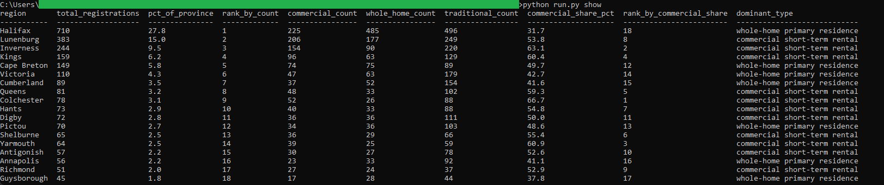

# 14: Short-term-rental pressure index

Ranks Nova Scotia's 18 census divisions by registered short-term rentals and by how commercial each region's registry mix is. The headline: Halifax carries by far the most registered STRs, 710 of the province's 2,556 (27.8 percent), yet its mix is the least commercial of any region (31.7 percent). Colchester runs the most commercial mix, 66.7 percent.

## The data

Nova Scotia Open Data: **Short-Term Accommodations Registry** (`a796-4rv8`). Source, licence, and pull date in SOURCE.md. (Catalog idea #31.)

## What it computes

Every step is deterministic and rule-based. All logic lives in `sql/`, named by step; `run.py` holds none of it. The pipeline unpivots the registry's per-division category counts into long rows, counts a registration as an STR when it sits in either the commercial short-term rental or the whole-home primary residence category, and takes the commercial category's part of that total as the region's commercial share (the exact rule is in spec.md). It then ranks regions two ways, by STR count and by commercial share, and repeats each region's share of the provincial total so the Tableau dashboard can be checked against the pipeline's own numbers. The source ships its own Total row; the SQL cross-checks it against the sum of the 18 divisions and aborts on any mismatch.

## Testing

DuckDB is the only dependency:

    pip install duckdb

From this folder:

    python run.py            # runs the SQL end to end, then verifies
    python run.py verify     # re-runs the golden diff only
    python run.py show       # prints the region pressure ranking

`python run.py` writes out/str_pressure_index.csv, checks it against expected/str_pressure_index.csv, and prints PASS when they match row for row. The Tableau build guide is in bi/README.md.

## License

MIT. Copyright (c) 2026 Kevin Yu (https://github.com/exekyute).
