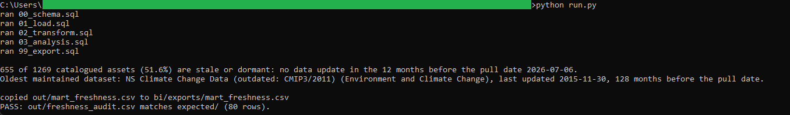
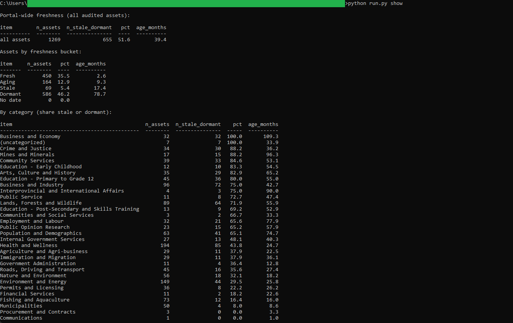
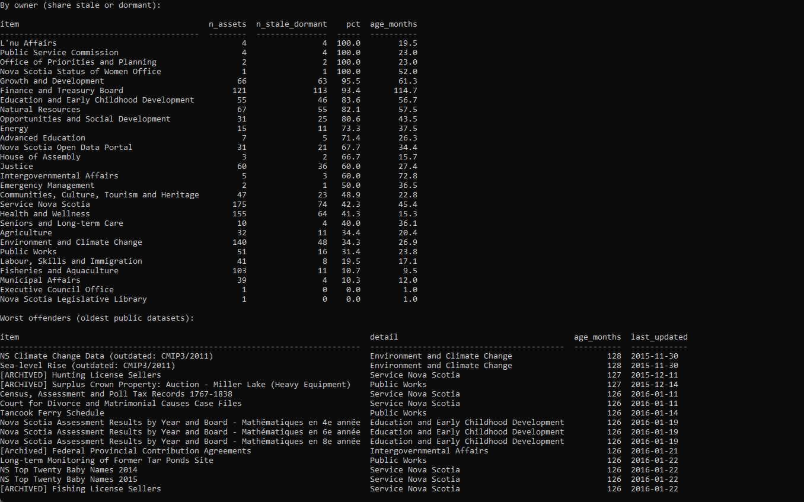

# 15: Open Data Catalogue freshness auditor

Audits every asset in Nova Scotia's Open Data portal against its own catalogue and buckets each one by how long ago its data last changed. The headline: 51.6 percent of the portal's 1,269 assets are stale or dormant (no data update in 12 months or more as of the pinned pull date), and 586 of them, 46.2 percent, have gone more than two years.

## The data

Nova Scotia Open Data: **NS Open Data Catalogue** (`3km6-ez4q`). Source, licence, and pull date in SOURCE.md. (Catalog idea #45.)

## What it computes

Every asset's age in months since its last data update, measured against the pinned pull date (2026-07-06, a literal in the SQL, never the wall clock), then a bucket per asset: fresh under 6 months, aging 6 to 11, stale 12 to 23, dormant 24 and up. On top of that sit portal-wide bucket counts, stale-share rollups by category and by owning department, and a worst-offenders list of the 15 oldest public datasets. All logic lives in `sql/`, named by step; `run.py` holds none of it.

## Testing

DuckDB is the only dependency:

    pip install duckdb

From this folder:

    python run.py            # runs the SQL end to end, then verifies
    python run.py verify     # re-runs the golden diff only
    python run.py show       # prints the freshness summary

`python run.py` writes out/freshness_audit.csv, checks it against expected/freshness_audit.csv, and prints PASS when they match row for row. The Power BI build guide is in bi/README.md.

## License

MIT. Copyright (c) 2026 Kevin Yu (https://github.com/exekyute).
