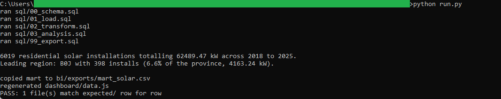
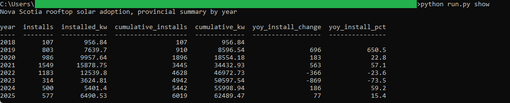
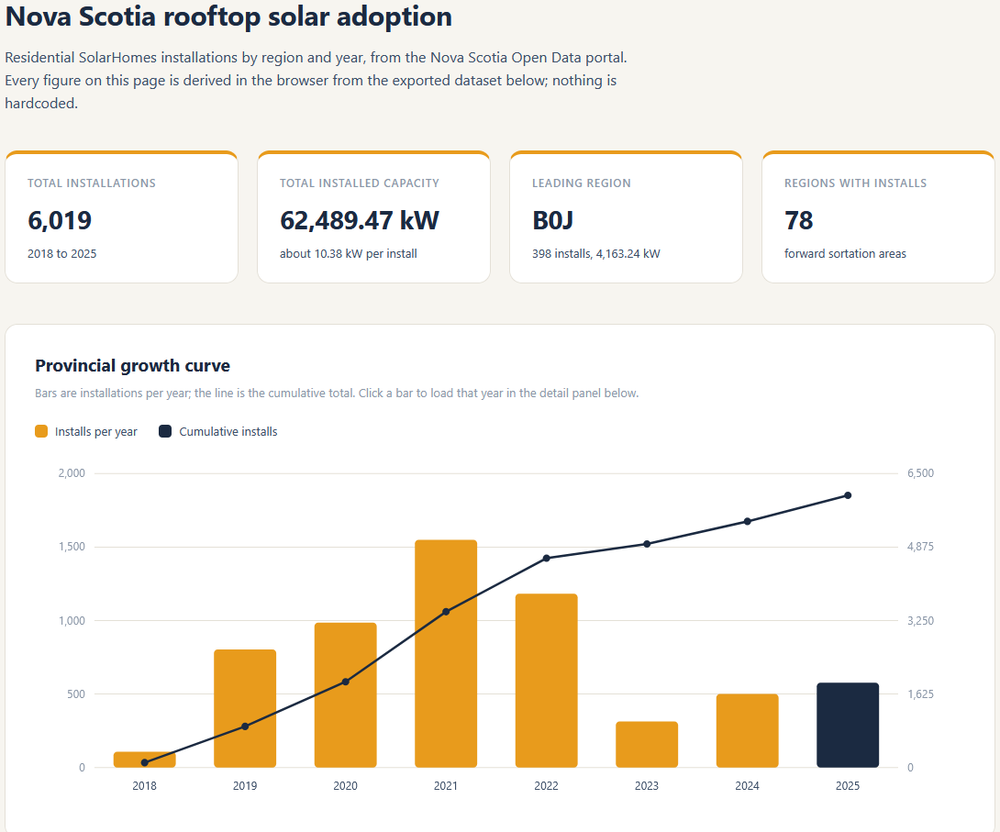

# 16: Rooftop solar adoption by region

Tracks residential solar uptake across Nova Scotia through the SolarHomes rebate
program: 6,019 installations totalling 62,489.47 kW between 2018 and 2025, led by the
rural B0J region with 398 installs. Adoption peaked at 1,549 installs in 2021, fell to
314 by 2023, then turned back up.

## The data

Nova Scotia Open Data: **Residential SolarHomes Installations** (`fsvq-ermw`). Source,
licence, and pull date in SOURCE.md. (Catalog idea #26.)

## What it computes

Installations and installed kW by forward sortation area (the first three postal
characters) and by year, the provincial growth curve with a cumulative running total,
year-over-year change, and the top regions by installs and by capacity. All logic lives
in `sql/`, named by step; `run.py` holds none of it. The browser dashboard reads the
exported mart and re-derives the same headline figures in JavaScript, so the page and
the golden CSV have to agree or one of them is wrong.

## Testing

DuckDB is the only dependency:

    pip install duckdb

From this folder:

    python run.py            # runs the SQL end to end, then verifies
    python run.py verify     # re-runs the golden diff only
    python run.py show       # prints the adoption summary

`python run.py` writes out/solar_adoption.csv, checks it against
expected/solar_adoption.csv, and prints PASS when they match row for row. Then
double-click dashboard/dashboard.html; it reads the exported data and re-derives the
same headline figures. The Tableau build guide is in bi/README.md.

## License

MIT. Copyright (c) 2026 Kevin Yu (https://github.com/exekyute).
