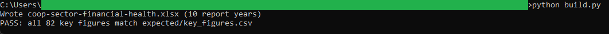
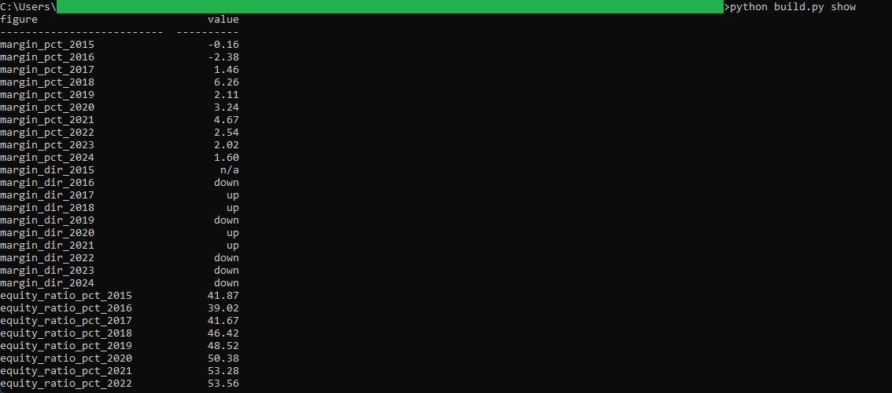

# 17: Co-op sector financial health

Models the financial health of Nova Scotia's co-operative sector from its annual regulatory summary. The headline: the sector's 2024 operating margin was 1.60 percent on $334.1 million of income, and its equity ratio fell for a second straight year to 39.24 percent, the lowest since 2016.

## The data

Nova Scotia Open Data: **Co-operatives Financial and Operating Summary** (`ff6i-nhbm`). Source, licence, and pull date in SOURCE.md. (Catalog idea #10.)

## What it computes

Everything is deterministic and formula-driven. For each report year the Model sheet computes the operating margin, equity ratio, solvency, and employees per reporting co-op as live divisions over the Data sheet. Year-over-year direction flags sit next to each ratio as plain `IF` formulas, and a totals block sums ten years of income, expenses, and net income straight off the snapshot's whole-dollar figures, so it ties exactly. `build.py` regenerates the workbook and verifies every key figure against a Python recomputation that rounds money half away from zero, exactly as Excel's `ROUND` does.

## Testing

openpyxl is the only dependency:

    pip install openpyxl

From this folder:

    python build.py            # rebuilds the workbook, then verifies
    python build.py verify     # re-runs the key-figure check only
    python build.py show       # prints the key figures as a table

`python build.py` regenerates coop-sector-financial-health.xlsx and checks every key figure against expected/key_figures.csv, printing PASS when they match. Open the workbook afterward; the Model sheet's headline cells (mapped in spec.md) show the same figures.

## License

MIT. Copyright (c) 2026 Kevin Yu (https://github.com/exekyute).
