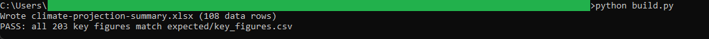
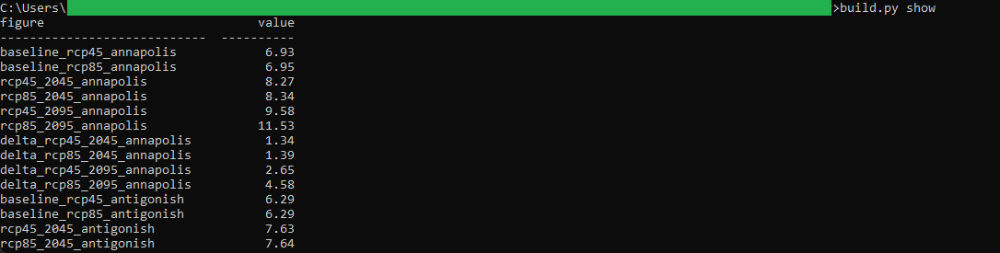

# 18: Climate-projection summary

Summarizes Nova Scotia's CMIP5 climate projections as per-county temperature deltas against the 1981-2010 baseline for RCP4.5 and RCP8.5 at the 2045 and 2095 horizons. The headline: Cumberland shows the largest late-century change, an annual mean temperature 4.81 degrees C above its baseline under RCP8.5 by 2065-2095, against an 18-county average of 4.55.

## The data

Nova Scotia Open Data: **NS Climate Change Projections CMIP5** (`r7d9-j7wx`). Source, licence, and pull date in SOURCE.md. (Catalog idea #27.)

## What it computes

Everything is deterministic and formula-driven. The Model sheet pivots the snapshot into per-county baseline and scenario values with `AVERAGEIFS`, subtracts each scenario's own 1981-2010 baseline to get RCP4.5 and RCP8.5 deltas at the 2045 and 2095 horizons, and ranks the 18 counties by their 2095 RCP8.5 delta through a tie-safe `LARGE` plus `INDEX`/`MATCH` block, all as live formulas. `build.py` regenerates the workbook and verifies every key figure against a Python recomputation of the same arithmetic, so the numbers in the cells and the numbers in the golden file are the same by construction.

## Testing

openpyxl is the only dependency:

    pip install openpyxl

From this folder:

    python build.py            # rebuilds the workbook, then verifies
    python build.py verify     # re-runs the key-figure check only
    python build.py show       # prints the key figures as a table

`python build.py` regenerates climate-projection-summary.xlsx and checks every key figure against expected/key_figures.csv, printing PASS when they match. Open the workbook afterward; the Model sheet's headline cells (mapped in spec.md) show the same figures.

## License

MIT. Copyright (c) 2026 Kevin Yu (https://github.com/exekyute).
