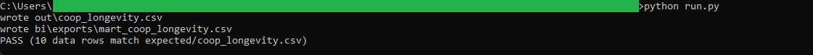
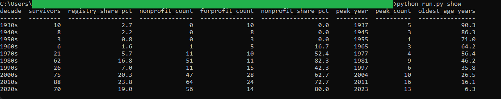

# 19: Co-op registry longevity

Profiles the 369 co-operatives on Nova Scotia's registry by incorporation decade: how many of each cohort survive, what share of the registry each holds, and how the non-profit mix shifts across them. Non-profits make up 65.3 percent of the registry, and the oldest surviving cohort is the 1930s: 10 co-ops still on the books, led by a Pomquet retail co-op incorporated in March 1936, 90.3 years old at the pull date.

## The data

Nova Scotia Open Data: **NS Co-operatives** (`k29k-n2db`). Source, licence, and pull date in SOURCE.md. (Catalog idea #33.)

## What it computes

Every count, share, and sort order is defined in the `sql/` files, named by step; `run.py` holds no logic. The registry lists only co-operatives registered as of its extract date, so presence in the snapshot is the active rule, which spec.md spells out. From there it counts incorporations by year, then builds one row per decade carrying the cohort's surviving count, its share of today's registry, its non-profit and for-profit split, its busiest year, and the age of its oldest survivor against a pinned pull date. The sharpest result is the mix shift: the pre-1960 cohorts contain no non-profits at all, while the 1980s and 2020s cohorts run near 80 percent non-profit.

## Testing

DuckDB is the only dependency:

    pip install duckdb

From this folder:

    python run.py            # runs the SQL end to end, then verifies
    python run.py verify     # re-runs the golden diff only
    python run.py show       # prints the cohort survivorship table

`python run.py` writes out/coop_longevity.csv, checks it against expected/coop_longevity.csv, and prints PASS when they match row for row. The Power BI build guide is in bi/README.md.

## License

MIT. Copyright (c) 2026 Kevin Yu (https://github.com/exekyute).
