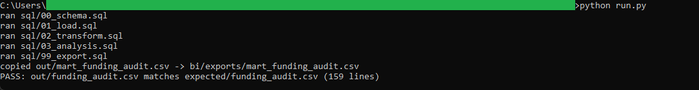
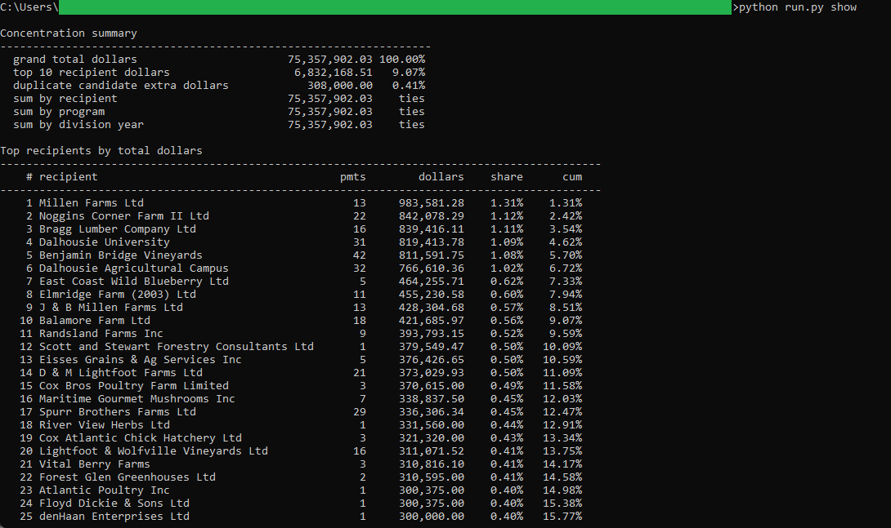

# 20: Agriculture funding payments audit

Audits 6,324 Nova Scotia agriculture funding payments worth $75,357,902.03 across eleven fiscal years (2014-2015 to 2024-2025). The top recipient, Millen Farms Ltd, collected $983,581.28, and the top 10 recipients together hold 9.07 percent of all dollars, so the money is spread wide rather than concentrated.

## The data

Nova Scotia Open Data: **Agriculture Funding Programs Details** (`jv92-pedy`). Source, licence, and pull date in SOURCE.md. (Catalog idea #9.)

## What it computes

Recipient totals over the full window, ranked by dollars with each recipient's share and the running cumulative share. Program shares for all 106 program labels, and division dollars by fiscal year with year-over-year change. Duplicate-payment candidates are flagged by a deterministic rule (same normalized recipient, program, amount to the cent, and fiscal year appearing more than once): 9 groups, worth $308,000.00 in occurrences beyond the first. All money math stays in DECIMAL, and the output carries a totals_tie section that re-sums every breakdown to the same grand total, exact to the cent. All logic lives in `sql/`; `run.py` holds none of it.

## Testing

DuckDB is the only dependency:

    pip install duckdb

From this folder:

    python run.py            # runs the SQL end to end, then verifies
    python run.py verify     # re-runs the golden diff only
    python run.py show       # prints the top recipients and concentration

`python run.py` writes out/funding_audit.csv, checks it against expected/funding_audit.csv, and prints PASS when they match row for row. The Power BI build guide is in bi/README.md.

## License

MIT. Copyright (c) 2026 Kevin Yu (https://github.com/exekyute).
