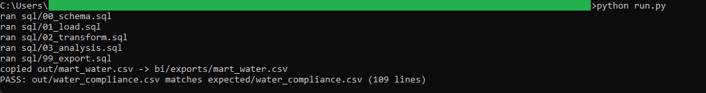
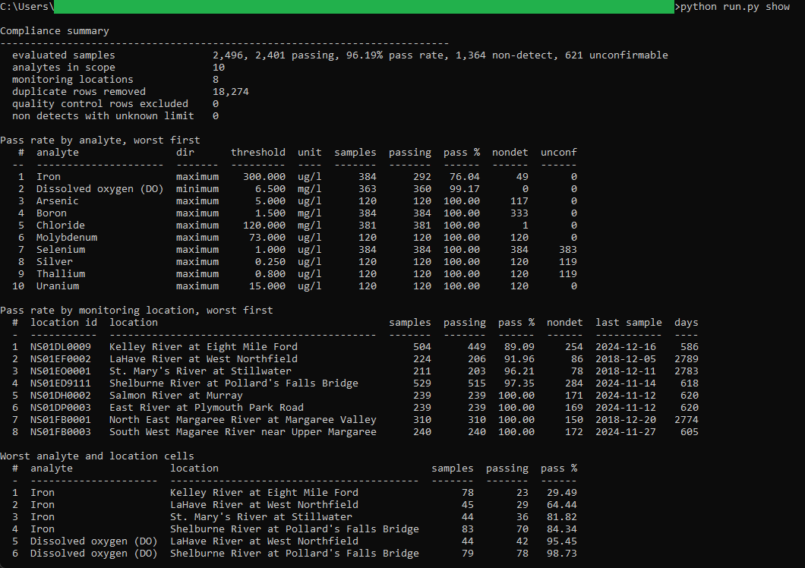

# 21: Water-quality guideline compliance

Scores 2,496 surface water results from eight Nova Scotia river monitoring stations against ten CCME aquatic life guidelines, 2002 to 2024: 2,401 pass, a rate of 96.19 percent. Iron is the one analyte that breaches regularly, at 76.04 percent overall and 29.49 percent at Kelley River at Eight Mile Ford, and 18,274 of the 38,143 published rows turned out to be byte-identical duplicates that would have re-weighted every rate had they been left in.

## The data

Nova Scotia Open Data: **Surface Water Grab Sample** (`wncu-ppda`). Source, licence, and pull date in SOURCE.md. (Catalog idea #25.)

## What it computes

Pass rates per analyte, per monitoring location, and per analyte-and-location cell, with the sample counts behind each and the cells that breach ranked worst first. A result passes when it sits at or below a maximum-direction guideline, or at or above a minimum-direction one, after its reading has been converted into the unit the guideline is written in. Nothing is dropped on the way: duplicate records, quality-control activity types, wrong sample fractions, unconvertible units, malformed values, and non-detects are each counted in a ledger that adds back up to the published row count, and 621 of the passes are flagged as unconfirmable because they are non-detects reported at a limit above their own guideline. All logic lives in `sql/`; `run.py` holds none of it.

## Testing

DuckDB is the only dependency:

    pip install duckdb

From this folder:

    python run.py            # runs the SQL end to end, then verifies
    python run.py verify     # re-runs the golden diff only
    python run.py show       # prints the compliance summary

`python run.py` writes out/water_compliance.csv, checks it against expected/water_compliance.csv, and prints PASS when they match row for row. The Power BI build guide is in bi/README.md.

## License

MIT. Copyright (c) 2026 Kevin Yu (https://github.com/exekyute).
